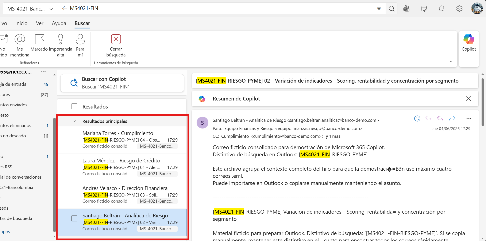
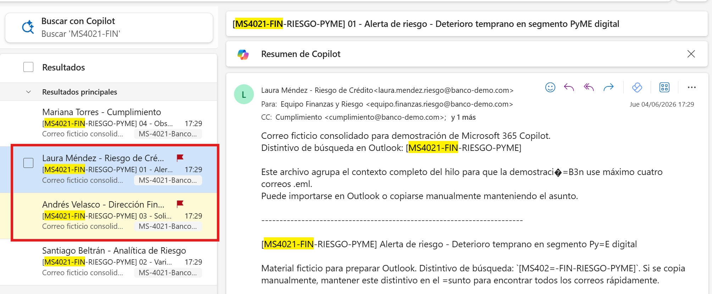
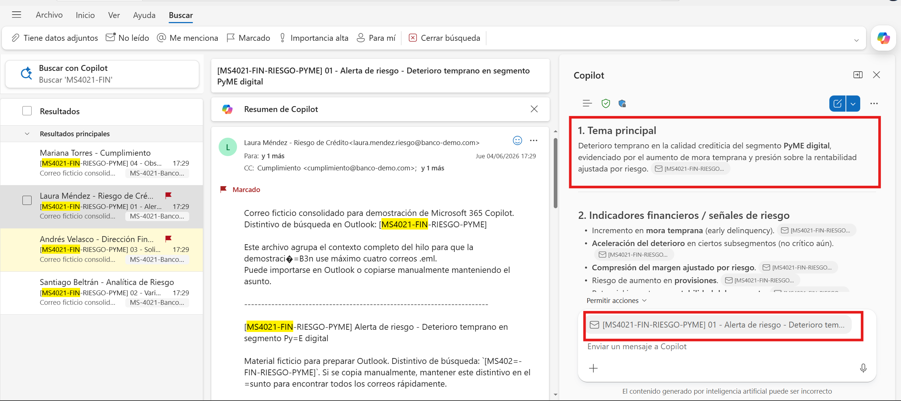
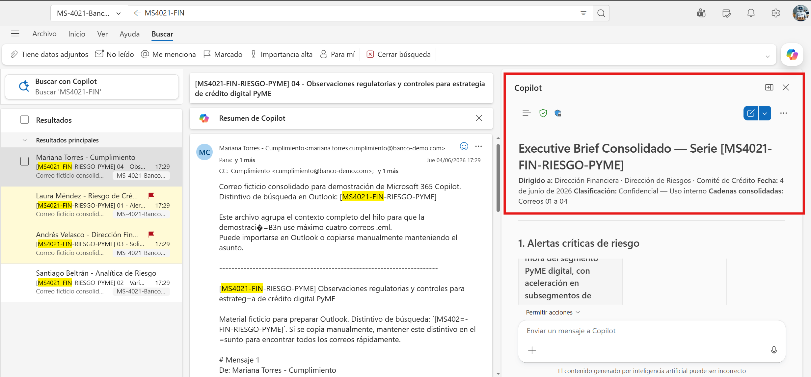
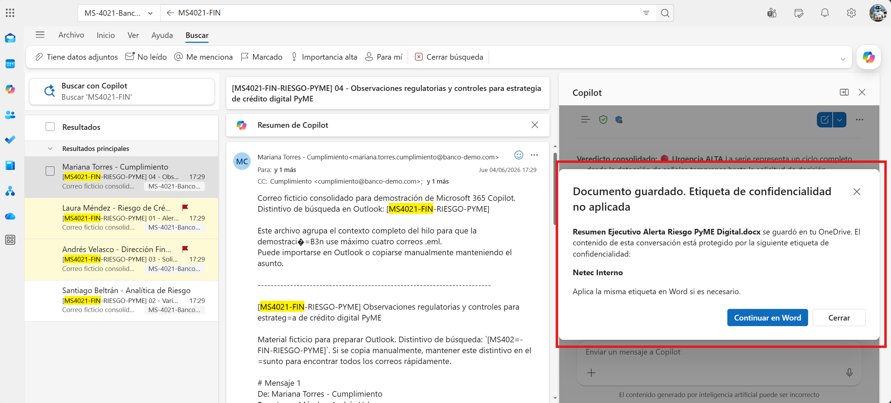
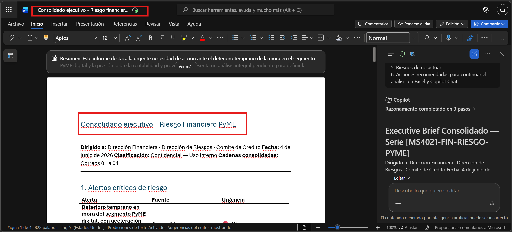
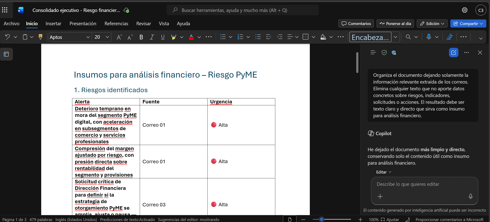

# Demostración 1. Preparar el contexto financiero y de riesgo desde Outlook

## Objetivo de la práctica:
Al finalizar la práctica, serás capaz de:
- Priorizar correos relacionados con alertas de riesgo, variaciones de indicadores y solicitudes críticas de análisis financiero.
- Usar Copilot en Outlook para resumir cadenas de correo con foco ejecutivo, identificando riesgos, áreas involucradas, decisiones pendientes y nivel de urgencia.
- Construir un bloque de contexto que alimente el análisis posterior en Excel y Microsoft 365 Copilot Chat.

## Duración aproximada:
- 25 minutos.

## Tabla de ayuda:
| Elemento | Valor de referencia | Observaciones |
| --- | --- | --- |
| Aplicación principal | Outlook con Microsoft 365 Copilot | Usar una cuenta corporativa con licencia de Microsoft 365 Copilot. |
| Escenario | Evaluación de riesgo para nuevas estrategias de otorgamiento de crédito PyME | El área de Riesgos del banco debe analizar comportamiento financiero y nivel de riesgo del segmento. |
| Entregable | Consolidado ejecutivo de alertas y solicitudes críticas | Será usado en la Demostración 2. |
| Seguridad de datos | Información ficticia | No usar datos reales de clientes, cartera, scoring, modelos o políticas internas sensibles. |

## Instrucciones 
<!-- Proporciona pasos detallados sobre cómo configurar y administrar sistemas, implementar soluciones de software, realizar pruebas de seguridad, o cualquier otro escenario práctico relevante para el campo de la tecnología de la información -->

### Tarea 1. Preparar el buzón y localizar los correos financieros.

**Paso 1.** Abrir Outlook con la cuenta corporativa asignada para la demostración.

>[!NOTE]
> Confirmar que el instructor haya enviado, importado o reenviado previamente los cuatro correos consolidados del kit ficticio. Cada correo contiene el contexto completo de una cadena y usa el distintivo `[MS4021-FIN-RIESGO-PYME]` en el asunto. El objetivo no es trabajar con información real del banco, sino simular un escenario de análisis financiero y de riesgo para clientes PyME.

**Paso 2.** Buscar primero con el distintivo `[MS4021-FIN-RIESGO-PYME]`. De forma complementaria, usar palabras clave como: `PyME`, `riesgo`, `mora`, `scoring`, `indicadores`, `otorgamiento`, `cumplimiento`, `finanzas`, `segmento`, `crédito digital`.

**Paso 3.** Identificar los cuatro correos consolidados que representan las siguientes perspectivas:
- Alertas de riesgo y deterioro temprano.
- Variaciones de indicadores financieros y scoring.
- Solicitudes críticas de análisis para nuevas estrategias de crédito PyME.
- Observaciones regulatorias, controles y mitigación.

> [!NOTE]
> Los asuntos sugeridos para esta demostración son:
> * `[MS4021-FIN-RIESGO-PYME] 01 - Alerta de riesgo - Deterioro temprano en segmento PyME digital`
> * `[MS4021-FIN-RIESGO-PYME] 02 - Variación de indicadores - Scoring, rentabilidad y concentración por segmento`
> * `[MS4021-FIN-RIESGO-PYME] 03 - Solicitud crítica - Evaluación de nuevas estrategias de otorgamiento PyME`
> * `[MS4021-FIN-RIESGO-PYME] 04 - Observaciones regulatorias y controles para estrategia de crédito digital PyME`



**Paso 4.** Marcar los hilos que requieren seguimiento ejecutivo inmediato, especialmente las alertas de deterioro temprano y la solicitud crítica de evaluación de nuevas estrategias de otorgamiento. Poner el mouse sobre el correo y seleccionar la bandera de seguimiento.



---

### Tarea 2. Usar Copilot en Outlook para resumir y priorizar las cadenas.

**Paso 1.** Abrir el primer hilo de correo relacionado con deterioro temprano en segmento PyME digital.

**Paso 2.** Seleccionar Copilot en Outlook y solicitar un resumen ejecutivo del hilo. "Alerta de riesgo - Deterioro temprano en segmento PyME digital".

Prompt sugerido:

```text
Resume esta cadena de correos desde una perspectiva ejecutiva para un área de Finanzas y Riesgos de un banco. Identifica:
1. Tema principal.
2. Indicadores financieros o señales de riesgo mencionadas.
3. Segmentos, productos o canales involucrados.
4. Riesgos financieros, regulatorios u operativos.
5. Oportunidades o acciones de mitigación.
6. Áreas involucradas.
7. Decisiones o acciones pendientes.
8. Nivel de urgencia: alto, medio o bajo.
```



**Paso 3.** Revisar la respuesta de Copilot y validar que no agregue datos no mencionados en el hilo.

**Paso 4.** Repetir el análisis con los otros tres correos consolidados.

**Paso 5.** Solicitar a Copilot que consolide los cuatro resúmenes en un solo bloque de texto, destacando urgencia, impacto y relación con la evaluación de crédito PyME.

Prompt sugerido:

```text
Consolida los resúmenes de los cuatro correos consolidados en un solo bloque ejecutivo. Prioriza la información según urgencia e impacto para la dirección financiera y líderes de riesgo.

Organiza el resultado con esta estructura:
1. Alertas críticas de riesgo.
2. Variaciones relevantes de indicadores financieros o scoring.
3. Solicitudes de análisis financiero pendientes.
4. Observaciones regulatorias o de cumplimiento.
5. Riesgos de no actuar.
6. Acciones recomendadas para continuar el análisis en Excel y Copilot Chat.
```



**Paso 6.** Al finalizar la respuesta de Copilot, seleccionar los tres puntos y usar la opción disponible para copiar, exportar o editar el contenido en Word.



**Paso 7.** Cambiar el título del documento o nota temporal a `Consolidado ejecutivo - Riesgo financiero PyME`.



>[!NOTE]
> Explicar a los participantes que este primer resultado no es el entregable final. Es el contexto que permitirá contrastar correos con datos en Excel y generar recomendaciones con Microsoft 365 Copilot Chat.

---

### Tarea 3. Preparar el insumo para el análisis financiero.

**Paso 1.** En Word pidele a copilot que organice el documento dejando solamente la información relevante extraída de los correos.

Prompt sugerido:

```text
Organiza el documento dejando solamente la información relevante extraída de los correos. Elimina cualquier texto que no aporte datos concretos sobre riesgos, indicadores, solicitudes o acciones. El resultado debe ser texto claro y directo que sirva como insumo para análisis financiero.

```
>[!NOTE]
> El objetivo es que el instructor termine con un bloque de texto limpio, estructurado y enfocado en datos e insights clave para la evaluación de riesgo financiero del segmento PyME. Este bloque se usará como contexto para cruzar con datos en Excel y generar recomendaciones en Copilot Chat.

### Resultado esperado
Al finalizar, el instructor debe contar con un consolidado ejecutivo generado a partir de cuatro correos consolidados donde se evidencia la necesidad de análisis financiero detallado para evaluar riesgos, oportunidades y estrategias de crédito para el segmento PyME digital.

