# Demostración 2. Analizar información financiera y de riesgo con Copilot en Excel y Copilot Chat

## Objetivo de la práctica:
Al finalizar la práctica, serás capaz de:
- Usar Copilot en Excel para ordenar datos, calcular revenue, crear tablas resumen y analizar clientes o segmentos con mayor exposición.
- Interpretar resultados financieros y señales de riesgo usando lenguaje ejecutivo orientado a dirección financiera.
- Usar Microsoft 365 Copilot Chat para sintetizar escenarios de riesgo, recomendaciones de mitigación y métricas de seguimiento.

## Duración aproximada:
- 35 minutos.

## Tabla de ayuda:
| Elemento | Valor de referencia | Observaciones |
| --- | --- | --- |
| Aplicaciones principales | Excel con Copilot, Microsoft 365 Copilot Chat | Trabajar con cuenta corporativa y archivo guardado en OneDrive o SharePoint. |
| Archivo base | `EV_Charger_Sales_Analysis_v1.xlsx` | Se usa como dataset de práctica de análisis financiero. |
| Resultado final | Escenarios de riesgo y recomendaciones ejecutivas | Será usado para preparar la presentación. |
| Nota de contexto | Dataset ficticio de práctica | No representa información real del banco. |

## Instrucciones 
<!-- Proporciona pasos detallados sobre cómo configurar y administrar sistemas, implementar soluciones de software, realizar pruebas de seguridad, o cualquier otro escenario práctico relevante para el campo de la tecnología de la información -->

### Tarea 1. Abrir el archivo y preparar la hoja principal.

**Paso 1.** Abrir Excel en el navegador o en la aplicación de escritorio.

**Paso 2.** Abrir el archivo `EV_Charger_Sales_Analysis_v1.xlsx` desde OneDrive o SharePoint.

**Paso 3.** Navegar a la hoja `Sales by Product`.

**Paso 4.** Seleccionar Copilot desde la cinta de opciones y abrir el panel de Copilot.

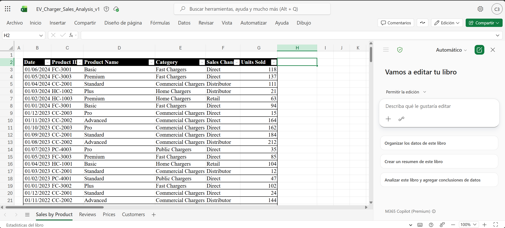

**Paso 5.** Solicitar a Copilot que ordene la tabla por fecha de forma descendente.

Prompt sugerido:

```text
Ordena la tabla por fecha en orden descendente, desde la entrada más reciente hasta la más antigua.
```

**Paso 6.** Seleccionar `Apply` cuando Copilot muestre la propuesta de ordenamiento.

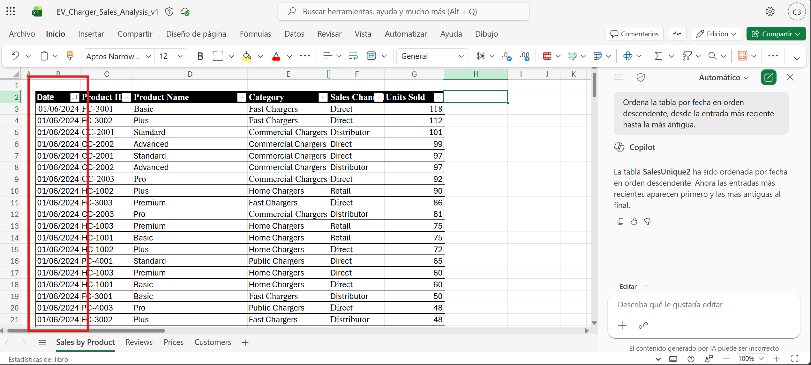

>[!NOTE]
> Explicar que ordenar de lo más reciente a lo más antiguo ayuda a enfocarse en señales actuales. En un análisis real de riesgo, esto permitiría evaluar cambios recientes de comportamiento financiero.

---

### Tarea 2. Calcular revenue y crear un resumen financiero 2024.

**Paso 1.** Solicitar a Copilot que agregue una columna de revenue total.

Prompt sugerido:

```text
En la hoja `Sales by Product`, agrega una nueva columna llamada 'Total Revenue'. Complétala multiplicando 'Units Sold' por 'Product Price' en cada fila. Usa la hoja `Prices` para encontrar el Product Price correcto según el Product ID.
```

**Paso 2.** Seleccionar `Insert Column` para agregar la nueva columna.

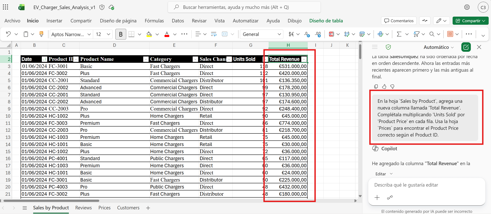

**Paso 3.** Solicitar una tabla resumen de 2024.

Prompt sugerido:

```text
Crea una tabla resumen en una nueva hoja de las ventas totales de 2024. La tabla debe incluir Product ID, Product Name, Category, total units sold y total revenue. Incluye solo datos de 2024.
```

**Paso 4.** Seleccionar `Add to a new Data Sheet` para guardar el resumen en una hoja separada.

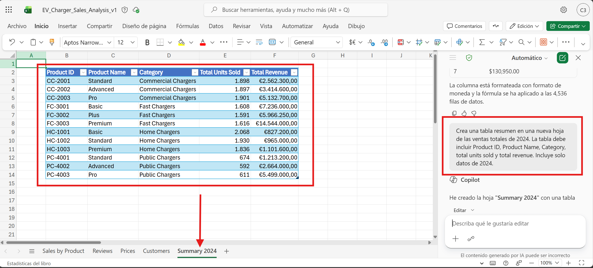

**Paso 5.** Identificar el producto con mayor revenue total en 2024.

Prompt sugerido:

```text
Identifica el Product ID con el mayor total revenue en 2024. Proporciona total revenue, total units sold, category y una interpretación ejecutiva breve de por qué esto es relevante para el análisis de riesgo financiero.
```

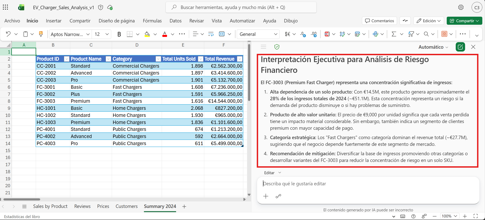

**Paso 6.** Solicitar a Copilot una interpretación ejecutiva para la dirección financiera.

Prompt sugerido:

```text
Explica el resumen de ventas de 2024 en lenguaje de negocio para una audiencia de riesgo financiero. Identifica qué productos o categorías concentran el mayor revenue, qué áreas pueden requerir monitoreo y qué preguntas deben validarse antes de cambiar una estrategia de crédito para clientes PyME.
```
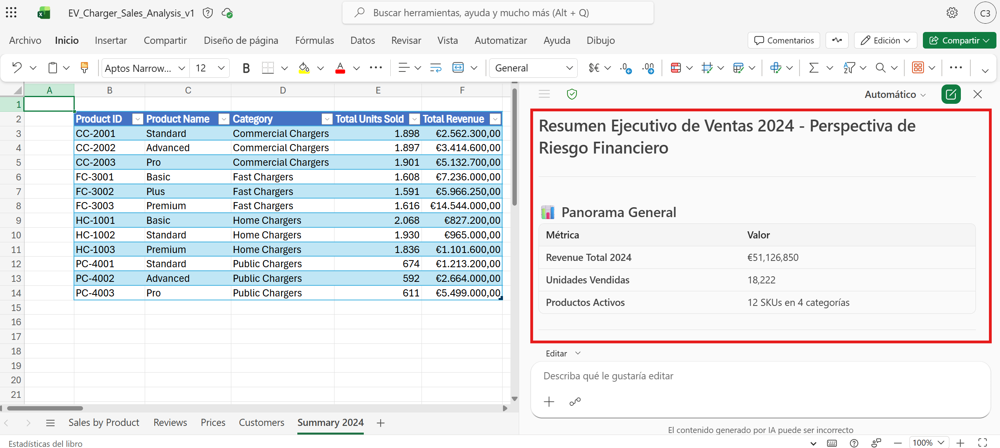

>[!NOTE]
> Aunque el archivo usa un escenario de EV chargers, la demostración debe transmitir el método: ordenar datos, calcular métricas, resumir información y traducir resultados en riesgos, oportunidades y preguntas de decisión.

---

### Tarea 3. Analizar clientes, concentración e industrias.

**Paso 1.** Navegar a la hoja `Customers`.

**Paso 2.** Solicitar a Copilot que ordene los clientes por revenue anual.

Prompt sugerido:

```text
Ordena la pestaña 'Customers' por annual revenue en orden descendente.
```

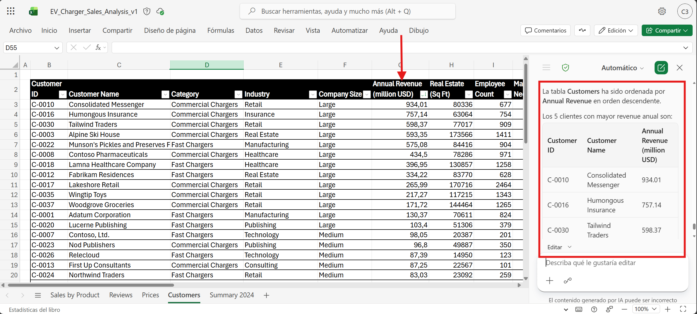

**Paso 3.** Calcular el revenue promedio por cliente.

Prompt sugerido:

```text
Calcula el revenue promedio por cliente. Inserta el resultado como una fila o nota claramente etiquetada en la hoja Customers.
```

**Paso 5.** Analizar la industria con mayor consumo o necesidad operativa.

Prompt sugerido:

```text
Analiza los datos para determinar qué industria tiene el mayor consumo total de energía. Proporciona el nombre de la industria, total power usage, número de clientes involucrados y una breve explicación de por qué este segmento puede representar mayor exposición o prioridad de monitoreo.
```

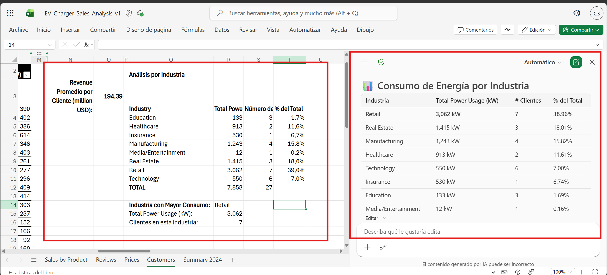

**Paso 6.** Solicitar una lectura de concentración y exposición.

Prompt sugerido:

```text
Usando la hoja Customers, identifica riesgos de concentración por industria y tamaño de cliente. Proporciona un resumen ejecutivo con:
1. Segmentos con mayor exposición.
2. Segmentos que pueden requerir monitoreo adicional.
3. Posibles implicaciones para una estrategia de crédito PyME.
4. Limitaciones de datos que deben validarse antes de tomar decisiones.
```

---

### Tarea 4. Analizar señales cualitativas en la hoja Reviews.

**Paso 1.** Navegar a la hoja `Reviews`.

**Paso 2.** Solicitar a Copilot que resuma las principales preocupaciones de clientes.

Prompt sugerido:

```text
Resume las 3 principales preocupaciones de clientes en las que debemos enfocarnos. Relaciona cada preocupación con un posible riesgo operativo, reputacional o financiero.
```

**Paso 3.** Solicitar que se resalten comentarios asociados con velocidad, fallas o experiencia deficiente.

Prompt sugerido:

```text
Resalta las reseñas que mencionen problemas relacionados con charging speeds, confiabilidad, problemas de instalación o mala experiencia del cliente.
```

**Paso 4.** Convertir los hallazgos cualitativos en señales de riesgo para el escenario PyME.

Prompt sugerido:

```text
Traduce los hallazgos de comentarios de clientes en señales de riesgo para un escenario de servicios financieros. Usa esta estructura:
- Señal observada.
- Posible riesgo financiero u operativo.
- Área responsable.
- Mitigación sugerida.
- Información que debe validarse.
```

---

### Tarea 5. Consolidar hallazgos en Microsoft 365 Copilot Chat.

**Paso 1.** Abrir Microsoft 365 Copilot Chat desde `https://m365.cloud.microsoft.com/`.

**Paso 2.** Seleccionar modo Web o Trabajo según disponibilidad del entorno y política del cliente.

**Paso 3.** Pegar los hallazgos obtenidos desde Excel y el consolidado de correos de la Demostración 1.

Prompt sugerido:

```text
Actúa como asesor de Finanzas y Riesgo para un banco. Con base en los hallazgos obtenidos desde Outlook y Excel, genera un análisis ejecutivo sobre la viabilidad de nuevas estrategias de otorgamiento de crédito para clientes PyME.

Necesito que entregues:
1. Resumen ejecutivo de máximo 180 palabras.
2. Principales tendencias financieras identificadas.
3. Categorías de riesgo: crédito, concentración, operativo, regulatorio y reputacional.
4. Escenario base, escenario de crecimiento controlado y escenario de estrés.
5. Recomendaciones de mitigación.
6. Métricas de seguimiento y éxito.
7. Decisiones que debería tomar la dirección financiera.

Información de entrada:
[Pegar aquí el consolidado de Outlook y los hallazgos de Excel]
```


**Paso 4.** Solicitar una tabla de escenarios.

Prompt sugerido:

```text
Convierte el análisis anterior en una tabla de escenarios con las columnas: Escenario, Supuesto principal, Riesgo esperado, Impacto financiero, Mitigación recomendada, Métrica de seguimiento y Decisión sugerida.
```
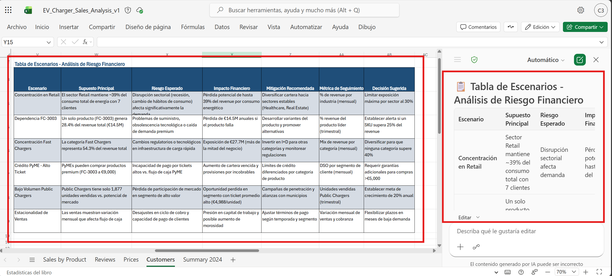

**Paso 5.** Solicitar a Copilot que separe hechos, supuestos y recomendaciones.

Prompt sugerido:

```text
Separa en hechos observados en los datos, supuestos Crea una tabla tabular en una hoja nueva que muestre hechos observados en los datos, supuestos inferidos y recomendaciones. Presenta el resultado de manera clara para lideres financieros y de riesgo.
```

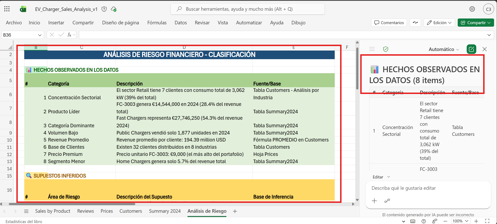

**Paso 6.** Realizar un ejercicio de aprendizaje y evaluación mediante juego de roles.

Prompt sugerido:

```text
Actúa como director de Riesgos del banco. Hazme cinco preguntas para validar si entiendo el análisis realizado. Las preguntas deben cubrir categorías de riesgo, interpretación de indicadores, escenarios, mitigaciones y métricas de seguimiento. Después de cada respuesta, dame retroalimentación breve.
```

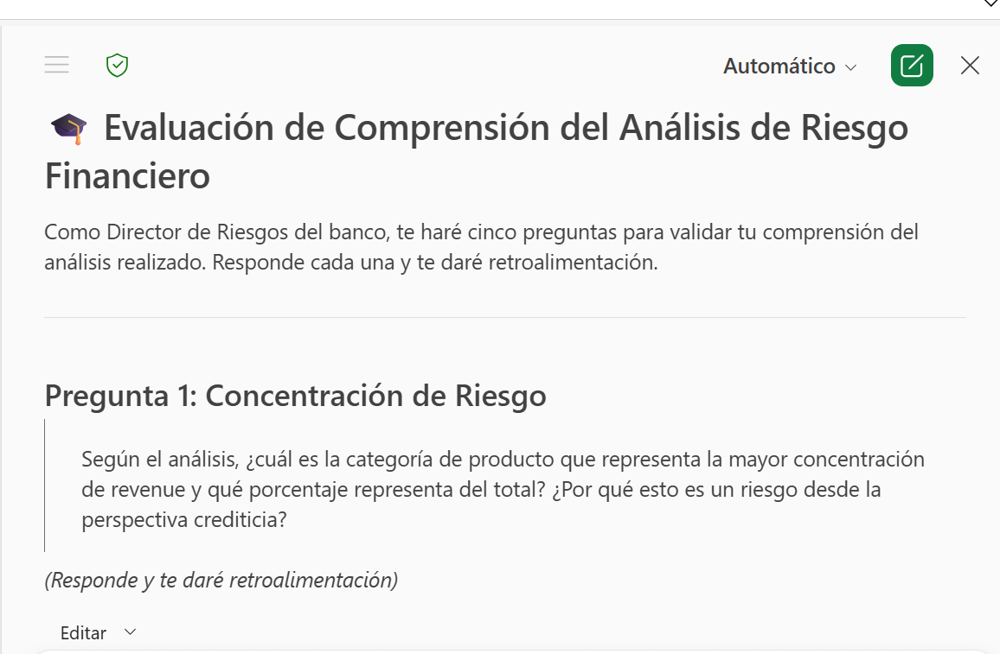

---

### Resultado esperado
Al finalizar la demostración, el participante debe observar cómo un dataset financiero se convierte en métricas y hallazgos financieros. 


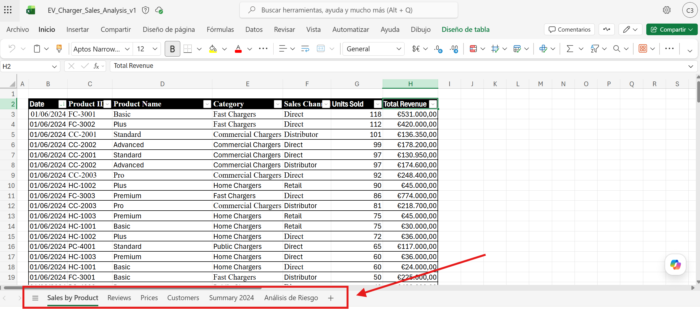