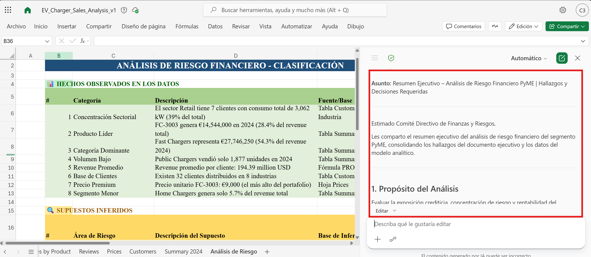
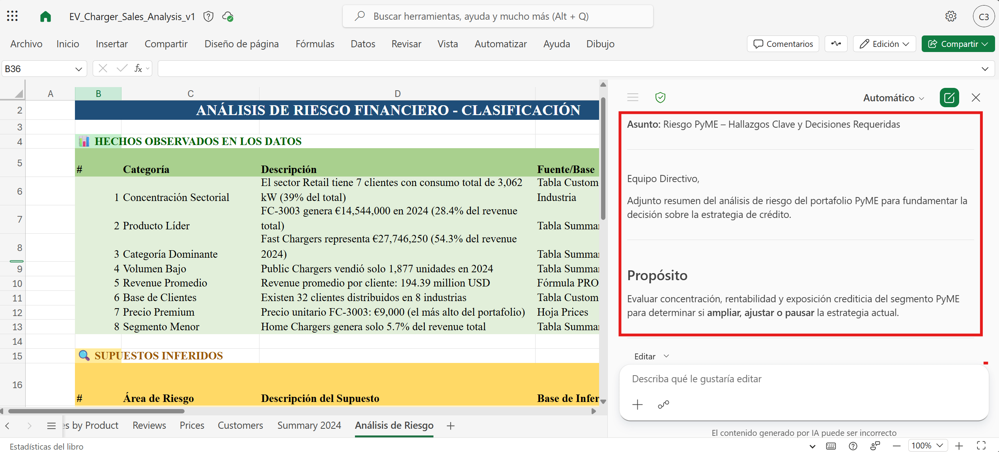
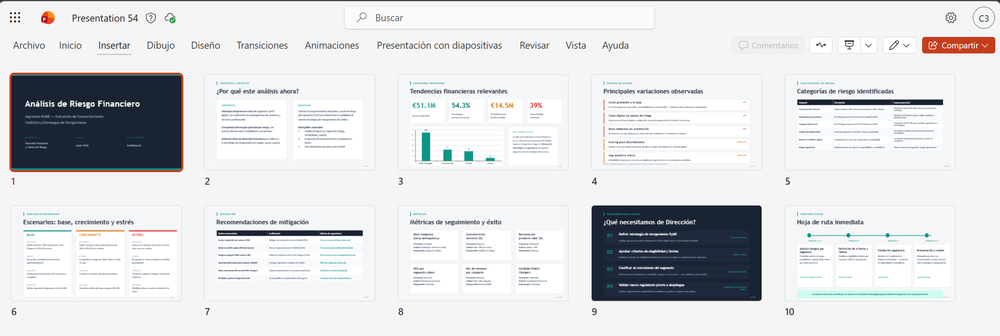
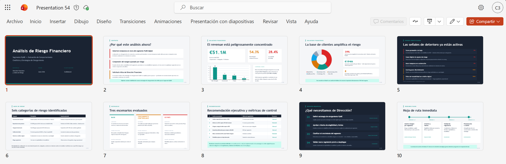
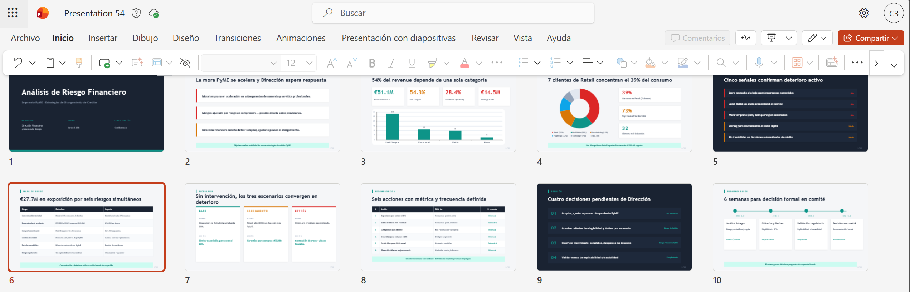
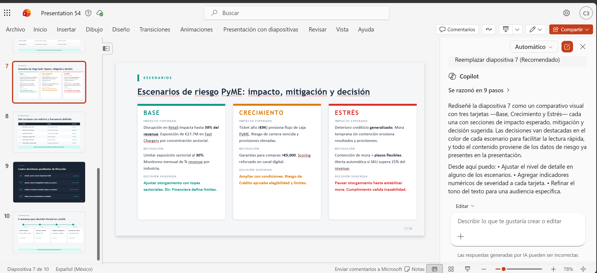
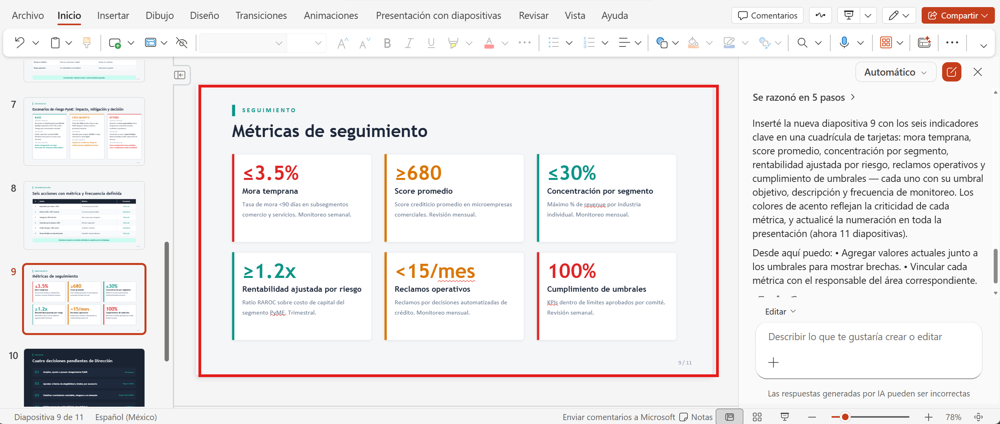
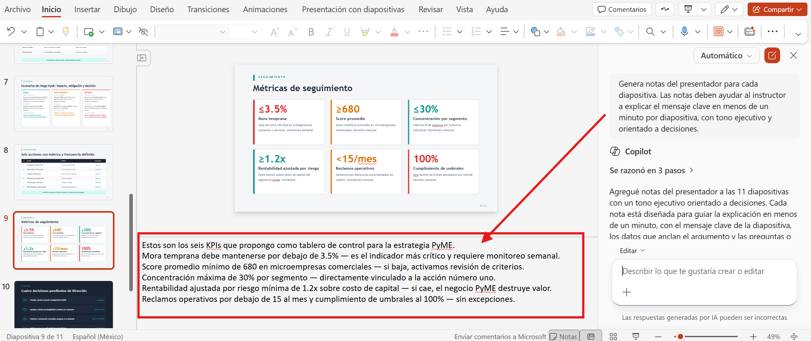
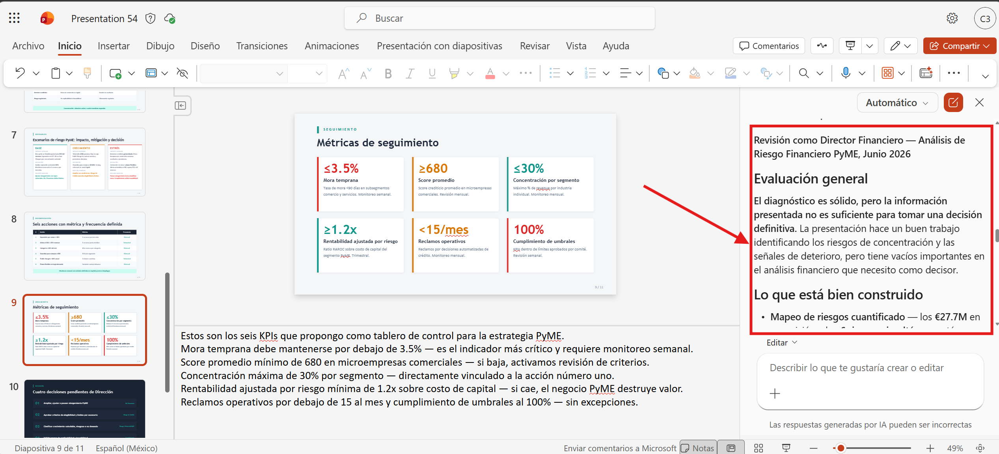
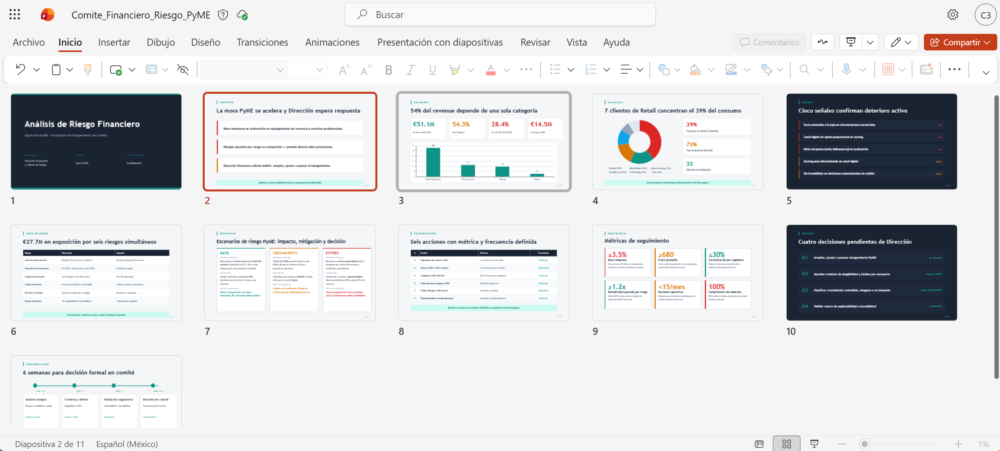

# Demostración 3. Preparar comunicación ejecutiva y presentación de hallazgos financieros con Copilot

## Objetivo de la práctica:
Al finalizar la práctica, serás capaz de:
- Transformar los hallazgos de Copilot Chat en un documento ejecutivo y un correo de síntesis para el equipo financiero.
- Crear una presentación ejecutiva en PowerPoint a partir del documento generado en Word.
- Refinar diapositivas relacionadas con tendencias financieras, categorías de riesgo, escenarios, métricas y recomendaciones estratégicas.

## Duración aproximada:
- 30 minutos.

## Tabla de ayuda:
| Elemento | Valor de referencia | Observaciones |
| --- | --- | --- |
| Aplicaciones principales | Word con Copilot, PowerPoint con Copilot | Usar cuenta corporativa con Microsoft 365 Copilot. |
| Insumo requerido | `Resumen_Riesgo_Financiero_PyME.docx` | Documento exportado o copiado desde Copilot Chat en la Demostración 2. |


## Instrucciones 
<!-- Proporciona pasos detallados sobre cómo configurar y administrar sistemas, implementar soluciones de software, realizar pruebas de seguridad, o cualquier otro escenario práctico relevante para el campo de la tecnología de la información -->

### Tarea 1. Crear un correo ejecutivo de síntesis en Word.

**Paso 1.** Abrir el archivo de excel `EV_Charger_Sales_Analysis_v1.xlsx` desde OneDrive o SharePoint.

**Paso 2.** Abrir Copilot en Excel

**Paso 3.** Solicitar a Copilot que redacte un correo para el equipo financiero y de riesgo. Adjunta el archivo `Consolidado de ejecutivo - Riesgo financiero PyME`.docx` (Documento generado en Demostración 1).

Prompt sugerido:

```text
Redacta un correo para mi equipo que resuma los hallazgos clave de este documento y excel. La audiencia es el equipo directivo de finanzas y riesgos de un banco.

El correo debe incluir:
1. Propósito del análisis.
2. Principales hallazgos financieros y de riesgo.
3. Acciones de mitigación recomendadas.
4. Métricas que deben monitorearse.
5. Decisiones requeridas antes de cambiar la estrategia de crédito PyME.

Usa un tono profesional, conciso y ejecutivo.
```


**Paso 4.** Pedir a Copilot que haga el mensaje más breve.

Prompt sugerido:

```text
Acorta este borrador de correo y hazlo más directo para líderes financieros senior.
```


**Paso 5.** Realizar una segunda mejora opcional para hacerlo más formal.

Prompt sugerido:

```text
Reformula el correo con un tono más profesional y ejecutivo. Mantén el mensaje conciso y enfocado en decisiones.
```

>[!NOTE]
> Explicar que el correo es un ejemplo de comunicación interna. Antes de enviarlo en un entorno real, se debe validar que no incluya cifras, supuestos o conclusiones no aprobadas.

---

### Tarea 2. Crear una presentación ejecutiva desde Word.

**Paso 1.** Abrir Microsoft PowerPoint con la cuenta corporativa asignada.

**Paso 2.** Crear una presentación nueva y abrir Copilot en PowerPoint.

**Paso 3.** Seleccionar `Agregar contenido de trabajo`, según la experiencia disponible en el entorno.

**Paso 4.** Buscar el documento `Consolidado ejecutivo - Riesgo financiero PyME.docx` y `EV_Charger_Sales_Analysis_v1.xlsx` en OneDrive o SharePoint. 

**Paso 5.** Solicitar a Copilot una presentación ejecutiva para dirección financiera.

Prompt sugerido:

```text
Crea una presentación ejecutiva de 10 diapositivas a partir de este documento. La audiencia es dirección financiera y líderes de riesgo de un banco. El objetivo es evaluar el comportamiento financiero y nivel de riesgo de un segmento de clientes PyME para determinar la viabilidad de nuevas estrategias de otorgamiento de crédito.

La presentación debe incluir:
1. Portada ejecutiva.
2. Contexto y objetivo del análisis.
3. Tendencias financieras relevantes.
4. Principales variaciones o drivers observados.
5. Categorías de riesgo identificadas.
6. Escenarios: base, crecimiento controlado y estrés.
7. Recomendaciones de mitigación.
8. Métricas de seguimiento y éxito.
9. Decisiones solicitadas a dirección.
10. Próximos pasos.

Usa lenguaje ejecutivo, mensajes breves y enfoque visual.
```



>[!NOTE]
> Si PowerPoint solicita aclaraciones, responder con información ejecutiva y evitar agregar cifras no validadas. La presentación generada debe considerarse un borrador para revisión humana.

---

### Tarea 4. Refinar la narrativa y las diapositivas clave.

**Paso 1.** Pedir a Copilot que reorganice la narrativa para toma de decisiones.

Prompt sugerido:

```text
Reorganiza la presentación para que cuente una historia ejecutiva clara: contexto, hallazgos financieros, riesgos, escenarios, recomendación, decisión requerida y próximos pasos. Mantén máximo una idea principal por diapositiva.
```



**Paso 2.** Solicitar que Copilot reduzca texto y mejore títulos.

Prompt sugerido:

```text
Mejora los títulos de las diapositivas para que sean mensajes ejecutivos, no solo nombres de secciones. Reduce el texto excesivo y deja únicamente los puntos necesarios para una reunión de dirección financiera.
```



**Paso 3.** Solicitar una diapositiva visual de escenarios.

Prompt sugerido:

```text
Convierte la sección de escenarios en una diapositiva visual comparando escenario base, crecimiento controlado y estrés. Incluye impacto esperado, mitigación y decisión sugerida para cada escenario.
```



**Paso 4.** Solicitar una diapositiva de métricas de seguimiento.

Prompt sugerido:

```text
Crea una diapositiva titulada "Métricas de seguimiento" con indicadores clave para monitorear la estrategia PyME: mora temprana, score promedio, concentración por segmento, rentabilidad ajustada por riesgo, reclamos operativos y cumplimiento de umbrales.
```


**Paso 5.** Solicitar notas del presentador.

Prompt sugerido:

```text
Genera notas del presentador para cada diapositiva. Las notas deben ayudar al instructor a explicar el mensaje clave en menos de un minuto por diapositiva, con tono ejecutivo y orientado a decisiones.
```



**Paso 6.** Revisar que las notas y diapositivas no agreguen compromisos regulatorios, cifras inventadas o conclusiones no sustentadas por los hallazgos.

>[!NOTE]
> Mencionar que el kit de marca corporativo no está cargado; sin embargo, desde el agente `crear` se pueden cargar plantillas organizacionales y kit de marca para uso individual. Indicar que el tutorial está publicado en el Canal de Early Adopters en Teams, si aplica para el cliente.

---

### Tarea 5. Validar la presentación final.

**Paso 1.** Confirmar que la presentación responda las preguntas clave de dirección:
- ¿Qué comportamiento financiero se observó?
- ¿Qué riesgos se identificaron?
- ¿Qué segmentos o indicadores requieren monitoreo?
- ¿Qué escenarios se evaluaron?
- ¿Qué mitigaciones se recomiendan?
- ¿Qué decisión debe tomar la dirección?

Prompt sugerido:

```text
Actúa como director financiero. Revisa esta presentación y dime si tienes suficiente información para tomar una decisión informada sobre la estrategia de crédito PyME. Si no, ¿qué información adicional necesitas? ¿Qué dudas o preocupaciones tienes sobre los hallazgos y recomendaciones presentados?
```


**Paso 2.** Guardar la presentación con el nombre `Comite_Financiero_Riesgo_PyME`.

**Paso 3.** Explicar que la experiencia completa mostró un flujo continuo: Outlook aportó alertas y solicitudes, Excel permitió analizar indicadores, Copilot Chat sintetizó escenarios y Word/PowerPoint prepararon la comunicación ejecutiva.

### Resultado esperado
Al finalizar la demostración, el participante debe observar una presentación ejecutiva lista para revisión humana y exposición ante líderes financieros y de riesgo.

